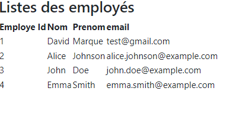

# React + Vite

# commande pour la creation 

## `npm create vite@latest emp-frontend `

- react 
- javascipt 

# ajoute de boustrap 

## `npm install boostrap --save`  

- Dans le fichier main.jsx on ajoute : import 'bootstrap/dist/css/bootstrap.min.css' 

tu peux tester on ajoutant className
```js
import React from 'react'

function HelloWord() {
  return (

  <h1 className='text-center'>Hello Word </h1>
  )
}

export default HelloWord

```

# Afficher la listes des employés d'un fichier json  


```js 
import React from 'react'


function ListesEmployes() {
   const data = [
  {
    id: 1,
    nom: "David",
    prenom: "Marque",
    email: "test@gmail.com"
  },
  {
    id: 2,
    nom: "Alice",
    prenom: "Johnson",
    email: "alice.johnson@example.com"
  },
  {
    id: 3,
    nom: "John",
    prenom: "Doe",
    email: "john.doe@example.com"
  },
  {
    id: 4,
    nom: "Emma",
    prenom: "Smith",
    email: "emma.smith@example.com"
  }
];


  return (
    
    <>
            <h2>Listes des employés</h2>

        <table >
  <thead>
    <tr>
      <th >Employe Id</th>
      <th >Nom</th>
      <th >Prenom</th>
      <th>email</th>
    </tr>
  </thead>
  <tbody>

    {data.map(employe=>
      <tr key={employe.id}>
        <td>{employe.id}</td>
       <td>{employe.nom}</td>
           <td>{employe.prenom}</td>
               <td>{employe.email}</td>
    </tr>
    )}

  
  
  </tbody>
</table>


     </>

  )
}

export default ListesEmployes

```



- boostrap CSS Container

 

# connexion avec rest api

## `npm install axios --save`
-creatiob EmployeService 


